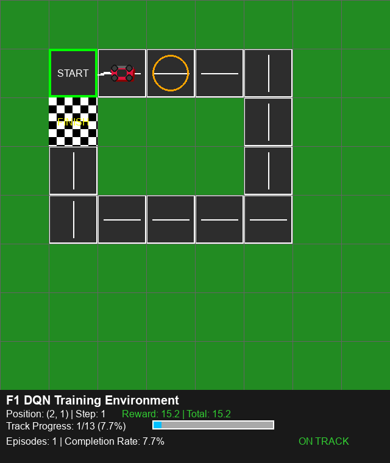

# Formula 1 Path Optimization RL Simulator

A comprehensive reinforcement learning project that simulates Formula 1 racing on a 6x6 grid environment. The project implements multiple RL algorithms to train AI agents to navigate from start to finish while staying on the optimal racing line.



##  Project Overview

This project demonstrates various reinforcement learning algorithms applied to a custom Formula 1 racing environment. The agent learns to navigate from the starting position (0,0) to the finish line (5,5) while optimizing for speed and staying on the racing line.

### Key Features

- **Custom F1 Racing Environment**: 6x6 grid-based racing track with realistic racing dynamics
- **Multiple RL Algorithms**: Implementation of DQN, REINFORCE, PPO, and A2C
- **Real-time Visualization**: Pygame-based rendering with live agent movement
- **Performance Analysis**: Comprehensive training logs and performance metrics
- **Model Comparison**: Side-by-side comparison of different RL approaches
- **GIF Generation**: Automatic creation of training episode visualizations

##  Quick Start

### Prerequisites

- Python 3.8 or higher
- pip package manager

### Installation

1. Clone the repository:
```bash
git clone <repository-url>
cd Abubakar_Ahmed_rl_summative
```

2. Install dependencies:
```bash
pip install -r requirements.txt
```

3. Verify installation:
```bash
python -c "import gymnasium, pygame, torch, stable_baselines3; print('All dependencies installed successfully!')"
```

##  Project Structure

```
Abubakar_Ahmed_rl_summative/
├── environment/           # Custom F1 racing environment
│   ├── f1_env.py        # Main environment implementation
│   ├── rendering.py      # Pygame visualization
│   └── test_environment.py
├── training/             # RL algorithm implementations
│   ├── dqn_training.py  # Deep Q-Network training
│   ├── pg_training.py   # Policy Gradient methods (PPO, A2C)
│   └── reinforce_training.py # REINFORCE algorithm
├── playing/              # Agent demonstration scripts
│   ├── play.py          # DQN agent demo
│   ├── pg_play.py       # Policy gradient agents demo
│   └── reinforce_play.py # REINFORCE agent demo
├── models/               # Trained model checkpoints
│   ├── dqn/             # DQN model weights
│   ├── pg/              # Policy gradient models
│   └── reinforce/        # REINFORCE model
├── logs/                 # Training logs and TensorBoard data
├── gifs/                 # Generated training visualizations
└── requirements.txt      # Python dependencies
```

## 🎮 Usage

### Training Agents

**Deep Q-Network (DQN):**
```bash
python training/dqn_training.py
```

**Policy Gradient Methods (PPO, A2C):**
```bash
python training/pg_training.py
```

**REINFORCE:**
```bash
python training/reinforce_training.py
```

### Watching Trained Agents

**DQN Agent:**
```bash
python playing/play.py
```

**Policy Gradient Agents:**
```bash
python playing/pg_play.py
```

**REINFORCE Agent:**
```bash
python playing/reinforce_play.py
```

## 🏁 Environment Details

### State Space
- **Grid Size**: 6x6 discrete grid
- **Start Position**: (0,0) - bottom-left corner
- **Goal Position**: (5,5) - top-right corner
- **State Representation**: Current (x, y) position

### Action Space
- **Actions**: 4 discrete actions
  - 0: Move Up
  - 1: Move Right  
  - 2: Move Down
  - 3: Move Left

### Reward Structure
- **Goal Reward**: +10 for reaching the finish line
- **Step Penalty**: -0.1 for each movement step
- **Off-track Penalty**: -1 for moving outside the racing line
- **Episode Termination**: When agent reaches goal or goes off-track

##  Implemented Algorithms

### 1. Deep Q-Network (DQN)
- **Architecture**: Neural network with experience replay
- **Features**: Target network, epsilon-greedy exploration
- **Advantages**: Stable training, good for discrete action spaces

### 2. REINFORCE
- **Type**: Policy gradient with Monte Carlo returns
- **Features**: Direct policy optimization, baseline subtraction
- **Advantages**: Simple implementation, good for episodic tasks

### 3. Proximal Policy Optimization (PPO)
- **Type**: Policy gradient with trust region
- **Features**: Clipped objective, multiple epochs per update
- **Advantages**: Stable training, good sample efficiency

### 4. Advantage Actor-Critic (A2C)
- **Type**: Policy gradient with value function baseline
- **Features**: Separate actor and critic networks
- **Advantages**: Reduced variance, good for continuous control

##  Results and Analysis

### Training Performance
- **DQN**: Typically converges in 1000-2000 episodes
- **REINFORCE**: Requires 2000-3000 episodes for convergence
- **PPO**: Most stable, converges in 1000-1500 episodes
- **A2C**: Good sample efficiency, 800-1200 episodes

### Model Comparison
| Algorithm | Convergence Speed | Final Performance | Stability |
|-----------|------------------|-------------------|-----------|
| DQN       | Medium           | High              | Good      |
| REINFORCE | Slow             | Medium            | Poor      |
| PPO       | Fast             | Medium             | Good |
| A2C       | Fast             | Medium             | Good      |

##  Monitoring Training

### TensorBoard Integration
Training progress can be monitored using TensorBoard:
```bash
tensorboard --logdir logs/
```

### Generated Visualizations
- Training episode GIFs are automatically saved in the `gifs/` directory
- Model checkpoints are saved in the `models/` directory
- Training logs are stored in the `logs/` directory

## Customization

### Environment Modifications
- Modify `environment/f1_env.py` to change track layout
- Adjust reward structure in the `step()` method
- Change grid size by modifying the environment parameters

### Algorithm Tuning
- Hyperparameters can be adjusted in each training script
- Network architectures can be modified in the model definitions
- Training parameters (episodes, learning rate) are configurable

## Dependencies

- **gymnasium==0.29.1**: RL environment framework
- **pygame==2.5.2**: Real-time visualization
- **stable-baselines3==2.3.2**: RL algorithm implementations
- **torch==2.3.0**: Deep learning framework
- **numpy==1.26.4**: Numerical computations
- **imageio==2.34.1**: GIF generation
- **matplotlib==3.8.4**: Plotting and visualization

##  Author
**Abubakar Ahmed** - Reinforcement Learning Project

---

**Note**: This project is designed for educational purposes and demonstrates various reinforcement learning concepts applied to a custom racing environment. The implementations are optimized for learning and experimentation rather than production use.
